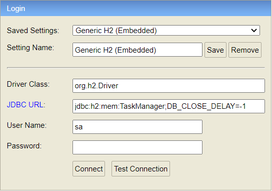

# **_Task Manager_**

API REST intended to handle CRUD calls for interacting with a task manager backend written in Java.

### **_1. How to start the backend application_**
After loading the zipped project in your preferred IDE, use Maven for compiling it:
```
mvn clean install
```

Run the application once it is already compiled using the IDE's command or button intended for it. For this project it has been used the IntelliJ platform, for example.

### **_2. Main specifications_**
The project has been developed with JAVA 8 and Spring Boot v2.3.4. 

It consists on an API REST with the typical HTTP crud operations:
- List all tasks
- Create a new task
- Delete a task
- Update a specific field from a task
- Update a task

In order to save the data and be able to make changes on it, it has been included on the project an H2 embedded database.
Moreover, some dummy data is pre-loaded in the database when the project execution starts. 

Embedded database link:
http://localhost:8080/h2

See below the connection details: 

 


### **_3. Easy to check the final results_**
A Swagger implementation has been developed in order to see all the REST operations available, adding the possibility to make some testing calls with them. 

Swagger link:
http://localhost:8080/swagger-ui.html#

Also, some REST calls launched with Postman has been added to the project.
